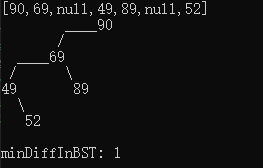

# my-practice-of-leetcode

这是一个记录每天刷leetcode的题目的repo；

计划从2021年4月11日开始每日一题；

题目选择为leetcode自动推荐的每日一题，因此是随机的；

解题思路等文字放在代码开头的注释中；

恳请大家批评指正！

### 题目难度——简单

[783. 二叉搜索树节点最小距离 minimum-distance-between-bst-nodes](https://github.com/honeysuckcle/my-practice-of-leetcode/blob/main/783%20%E4%BA%8C%E5%8F%89%E6%90%9C%E7%B4%A2%E6%A0%91%E8%8A%82%E7%82%B9%E6%9C%80%E5%B0%8F%E8%B7%9D%E7%A6%BB%20AC.cpp)
这道题和第530题要解决的问题相同

### 题目难度——中等

[179. 最大数 largest-number](https://github.com/honeysuckcle/my-practice-of-leetcode/blob/main/179%20%E6%9C%80%E5%A4%A7%E6%95%B0%20AC.cpp)

[208. 实现Trie](https://github.com/honeysuckcle/my-practice-of-leetcode/blob/main/208%20%E5%AE%9E%E7%8E%B0Trie%20AC.cpp)

[264. 丑数Ⅱ ugly-number-ii](https://github.com/honeysuckcle/my-practice-of-leetcode/blob/main/264%20%E4%B8%91%E6%95%B02%20AC.cpp)

