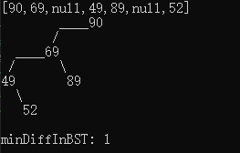
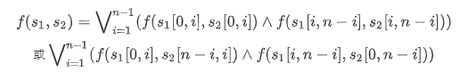

# my-practice-of-leetcode

这是一个记录每天刷leetcode的题目的repo；

计划从2021年4月11日开始每日一题；

题目选择为leetcode自动推荐的每日一题，因此是随机的；

解题思路等文字放在代码开头的注释中；

恳请大家批评指正！

看到一个解决github无法显示图片的解决办法，指路☞[【小技巧】(超详细！)解决Github无法显示图片以及README无法显示图片](https://blog.csdn.net/qq_41709370/article/details/106282229)

### 题目难度——简单

[26. 删除有序数组中的重复项 remove-duplicates-from-sorted-array](https://github.com/honeysuckcle/my-practice-of-leetcode/blob/main/easy/26%20remove-duplicates-from-sorted-array.cpp)

[27. 移除元素 remove-element](https://github.com/honeysuckcle/my-practice-of-leetcode/blob/main/easy/27%20remove-element.cpp)

[28. 实现 strStr() implement-strstr KMP算法](https://github.com/honeysuckcle/my-practice-of-leetcode/blob/main/easy/28实现strStr.cpp)

[783. 二叉搜索树节点最小距离 minimum-distance-between-bst-nodes](https://github.com/honeysuckcle/my-practice-of-leetcode/blob/main/easy/783%20%E4%BA%8C%E5%8F%89%E6%90%9C%E7%B4%A2%E6%A0%91%E8%8A%82%E7%82%B9%E6%9C%80%E5%B0%8F%E8%B7%9D%E7%A6%BB%20AC.cpp)
这道题和第530题要解决的问题相同

### 题目难度——中等

[91. 解码方法 submissions](https://github.com/honeysuckcle/my-practice-of-leetcode/blob/main/medium/91submissions.cpp)

[179. 最大数 largest-number](https://github.com/honeysuckcle/my-practice-of-leetcode/blob/main/medium/179%20%E6%9C%80%E5%A4%A7%E6%95%B0%20AC.cpp)

[208. 实现Trie implement-trie-prefix-tree](https://github.com/honeysuckcle/my-practice-of-leetcode/blob/main/medium/208%20%E5%AE%9E%E7%8E%B0Trie%20AC.cpp)

[220. 存在重复元素Ⅲ contains-duplicate-iii](https://github.com/honeysuckcle/my-practice-of-leetcode/blob/main/medium/220%20contains-duplicate-iii.cpp)

[213. 打家劫舍 house-robber-ii](https://github.com/honeysuckcle/my-practice-of-leetcode/blob/main/medium/213%20%E6%89%93%E5%AE%B6%E5%8A%AB%E8%88%8D%E2%85%A1%20AC%200ms.cpp)

[264. 丑数Ⅱ ugly-number-ii](https://github.com/honeysuckcle/my-practice-of-leetcode/blob/main/medium/264%20%E4%B8%91%E6%95%B02%20AC.cpp)

### 题目难度——困难

[87. 扰乱字符串 scramble-string](https://github.com/honeysuckcle/my-practice-of-leetcode/blob/main/hard/87%20scramble-string.cpp)
动态规划——转移方程：

其中：n表示s1.length==s2.length，*s*1(*x*,*y*) 表示从 *s*1 从第 x个字符（从 0开始编号）开始，长度为 y的子串
